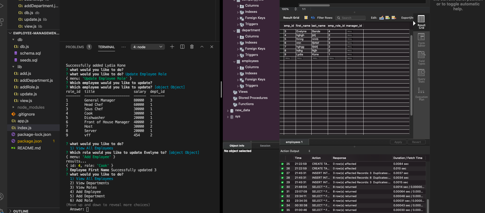

# Employee-Management-System

As a developer i created an app that make it easy for non-developers to view and interact with information stored in databases. This app allows business owners to view and manage the departments, roles, and employees in their companies so they can organize and plan their business.

## functionality

Business owners are able to: 

* Add departments, roles, employees

* View departments, roles, employees

* Update employee roles

### DEMO LINK

[see demo](https://drive.google.com/drive/folders/13qLHqcJc5BNF06SUUTuxrMYzG15lReZQ)

